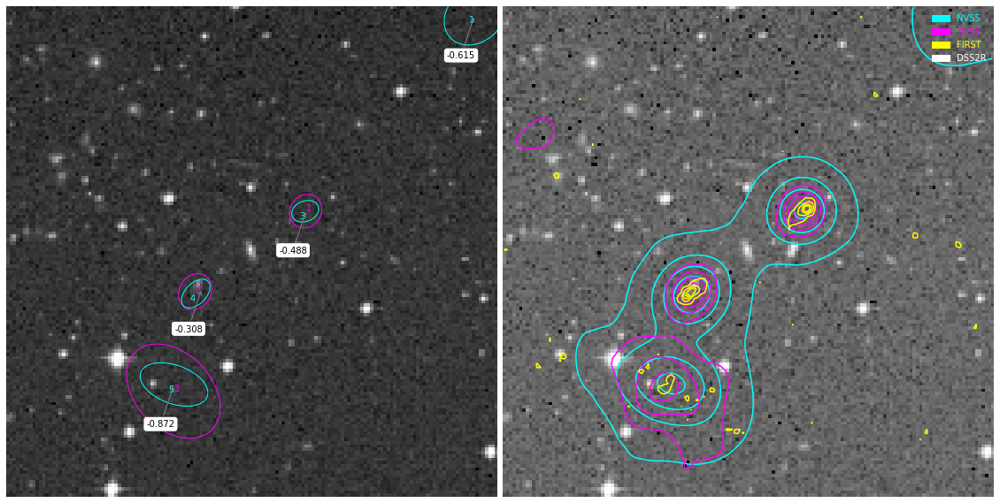

**************************************
Example: RGBMaker
**************************************

Example 1
==========

*Making composite image of TGSS - DSS2 Red - NVSS with catalog data from Vizier and 
Spectral Index data from Spidx file* `catalog <http://tgssadr.strw.leidenuniv.nl/doku.php?id=spidx/>`_ -  de Gasperin, Intema & Frail, MNRAS, 474, 5008 (2018).

.. code-block:: python

    from rgbmaker.fetch import query
    import pathlib
    filepath = pathlib.Path('__file__').parent.resolve() /  "../../jupyter-checks/spidx.fits"
    position='speca'
    query(position=position, px=150, kind='plot', annot=0, spidx_file=filepath)

.. code-block:: python

    [output] :

    ('success',
    [{'img1': 'data:image/png;base64,plotted'}],
    'completed in 9.146. ',
    [{'NVSS': 'value ranges from -0.0020 to 0.0356'},
    {'TGSS ADR1': 'value ranges from -0.0145 to 0.0775'},
    {'VLA FIRST (1.4 GHz)': 'value ranges from -0.0008 to 0.0086'},
    {'Target center': '14h09m48.82860267s -03d02m33.04700421s'},
    {'TGSS contour ': '[0.015 0.031 0.046 0.062]'},
    {'FIRST contour ': '[0.0005 0.0025 0.0045 0.0065]'},
    {'NVSS contour ': '[0.0015 0.01   0.0185 0.027 ]'},
    {'S_TGSS-1': '94.2 mJy'},
    {'S_TGSS_e-1': '12.1 mJy'},
    {'S_TGSS-2': '100.6 mJy'},
    {'S_TGSS_e-2': '12.6 mJy'},
    {'S_TGSS-3': '424.0 mJy'},
    {'S_TGSS_e-3': '42.6 mJy'},
    {'S_NVSS-1': '9.2 mJy'},
    {'S_NVSS_e-1': '1.2 mJy'},
    {'S_NVSS-2': '16.9 mJy'},
    {'S_NVSS_e-2': '2.1 mJy'},
    {'S_NVSS-3': '32.5 mJy'},
    {'S_NVSS_e-3': '1.4 mJy'},
    {'S_NVSS-4': '45.0 mJy'},
    {'S_NVSS_e-4': '2.0 mJy'},
    {'S_NVSS-5': '60.0 mJy'},
    {'S_NVSS_e-5': '2.6 mJy'},
    {'S_NVSS-6': '4.3 mJy'},
    {'S_NVSS_e-6': '0.4 mJy'}])

Example 2
==========

.. jupyter-execute::

    from rgbmaker.imgplt import pl_powerlawsi
    S = [424.0, 60.0]
    S_e = [42.6, 2.6]

    pl_powerlawsi(S,S_e)

